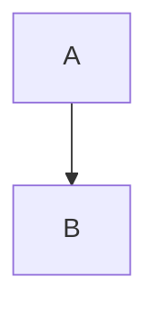

# AI Agent Instructions for MDX Report Generation

**EAE Skillset6 / EduArt OS – Agent Compilation Rulebook v1.0**

## Purpose

This document provides complete instructions for ChatGPT, Claude, or any AI agent to generate valid, high-quality MDX reports that follow the EAE Universal Report Template Engine specification.

---

## Quick Start

When asked to create an MDX report, follow these steps:

1. ✅ Start with valid frontmatter
2. ✅ Use OpeningFrame with YouTube video
3. ✅ Write Part1 in simple, analogical language
4. ✅ Write Part2 with technical architecture
5. ✅ Write Part3 with Mermaid diagram and philosophy
6. ✅ Add optional SketchCard (if visual needed)
7. ✅ Add optional SpotifyEmbed (if music fits)
8. ✅ End with PromptEngineLink (REQUIRED)

---

## Golden Rules (Never Break These)

### 🔴 Rule #1: Component Order is FIXED

```mdx
1. Frontmatter (---)
2. <OpeningFrame />  
3. <Part1>...</Part1>
4. <Part2>...</Part2>
5. <Part3>...</Part3>
6. <SketchCard>...</SketchCard> (optional)
7. <SpotifyEmbed /> (optional)
8. <PromptEngineLink /> (REQUIRED)
```

**Never reorder these components.**

### 🔴 Rule #2: Always Valid MDX

- All JSX tags must close properly
- No raw HTML mixed in
- Props must use correct syntax
- Code blocks must use triple backticks

### 🔴 Rule #3: Part3 MUST Use PapyrusScroll

**Wrong:**
```mdx
<Part3>
## Theory Map

</Part3>
```

**Wrong:**
```mdx
<Part3>
<Accordion title="Summary">
  Content here...
</Accordion>
</Part3>
```

**Correct:**
```mdx
<Part3>

<PapyrusScroll title="Whitepaper Global Summary">

**Core Summary**
- Main message in 2-4 sentences.

**Drivers / Modules**
- Core components listed.

**Mermaid Structure Summary**
A((Input)) --> B((Process)) --> C((Output))

**PARKSY OS Mapping**
- Connection to meta framework.

**Next Steps / Expansion**
- Follow-up directions.

</PapyrusScroll>

</Part3>
```

**Key Points:**
- Part3 is ALWAYS wrapped in `<PapyrusScroll>`
- NO other UI components (Accordion, Card, etc.) in Part3
- Mermaid diagrams are TEXT SUMMARIES, not rendered
- Initial collapsed state is automatic (component handles it)

### 🔴 Rule #4: Mobile-First Content

- Keep paragraphs 3-6 lines
- Avoid long walls of text
- Use visual components
- Break up content with headings

### 🔴 Rule #5: Required Frontmatter

```mdx
---
title: "Clear, Descriptive Title"
date: "YYYY-MM-DD"
category: "category-name"
---
```

**Every MDX file MUST start with this.**

---

## Component Usage Guide

### OpeningFrame

**Accept either format:**

```mdx
<OpeningFrame 
  videoId="dQw4w9WgXcQ"
  title="Introduction to the Topic"
  description="Optional brief intro"
/>
```

Or:

```mdx
<OpeningFrame 
  src="https://www.youtube.com/watch?v=dQw4w9WgXcQ"
  title="Introduction to the Topic"
/>
```

**Props:**
- `videoId` (string): YouTube video ID
- `src` (string): Full YouTube URL (alternative to videoId)
- `title` (string): Video title
- `description` (string, optional): Brief description

### Part1: Grandpa Mode

**Purpose:** Explain using analogies and simple language

**Style Guidelines:**
- Use everyday metaphors
- Tell mini-stories
- Avoid technical jargon
- 3-4 sentence paragraphs
- Make it conversational

**Example:**
```mdx
<Part1>

## Let me explain it simply

Imagine you have a toolbox. Each tool inside has a special purpose.

A hammer for nails. A screwdriver for screws. A wrench for bolts.

Skillset6 is like that toolbox, but for your ideas and creativity.

</Part1>
```

### Part2: System Architect Mode

**Purpose:** Explain technical structure and flow

**Style Guidelines:**
- Include architecture diagrams (ASCII or description)
- Show data flow
- List tech stack
- Use code blocks for structure
- Still keep accessible to non-developers

**Example:**
```mdx
<Part2>

## System Architecture

### Data Flow

```
Input → Processing → Output
  ↓         ↓          ↓
Feed → Digest → Expression
```

### Tech Stack

- React 18
- Vite
- Tailwind CSS
- MDX

### How It Works

The system takes MDX input, transforms it with React components, applies Tailwind styling, and outputs a complete web application.

</Part2>
```

### Part3: Theory Map & PapyrusScroll

**Purpose:** Connect to academic/philosophical foundations and provide meta-level whitepaper summary

**🔴 MANDATORY: Part3 MUST use PapyrusScroll wrapper**

**Required Structure:**
```mdx
<Part3>

<PapyrusScroll title="Whitepaper Global Summary">

**Core Summary**
- Main message compressed in 2–4 sentences.

**Drivers / Modules**
- List core drivers, modules, variables (3–6 lines).

**Mermaid Structure Summary**
Represent the structure in plain text (no rendered Mermaid):
A((Input)) --> B((Process)) --> C((Output))

**PARKSY OS Mapping**
- How this report connects to the meta system.

**Next Steps / Expansion**
- Follow-up documents or applications.

</PapyrusScroll>

</Part3>
```

**Critical Rules:**
- Part3 MUST be wrapped in `<PapyrusScroll>` - NO EXCEPTIONS
- NO other UI components (Accordion, Card, etc.) inside Part3
- Mermaid diagrams in Part3 must be TEXT SUMMARIES, not rendered
- Content must be architect/designer perspective, not essay style
- Initial state is collapsed by default (handled by component)

**Five Required Elements in PapyrusScroll:**
1. **Core Summary** - System-level message (2-4 sentences)
2. **Drivers / Modules** - Core technical components (3-6 lines)
3. **Mermaid Structure Summary** - Plain text diagram representation
4. **PARKSY OS Mapping** - Connection to meta framework (2-3 lines)
5. **Expansion Path** - Future directions (1-3 lines)

### SketchCard (Optional)

**Use when:** Visual sketch would help understanding

**Two modes:**

Mode 1 - Image URL:
```mdx
<SketchCard 
  title="Flow Diagram"
  src="/images/sketch.png"
  caption="How data flows through the system"
/>
```

Mode 2 - Inline SVG (demonstrated in gold-template.mdx):
```mdx
<SketchCard title="Custom Sketch">
  <svg viewBox="0 0 400 300" xmlns="http://www.w3.org/2000/svg">
    <rect x="50" y="50" width="100" height="60" fill="#3B82F6" rx="5"/>
    <text x="100" y="85" fontSize="14" textAnchor="middle" fill="white">Box</text>
  </svg>
</SketchCard>
```

**Note:** When both `src` and `children` are provided, `src` takes precedence.

### SpotifyEmbed (Optional)

**Use when:** Music/atmosphere enhances the content

```mdx
<SpotifyEmbed 
  track="3n3Ppam7vgaVa1iaRUc9Lp"
  title="Background Music"
/>
```

**Track ID formats accepted:**
- ID only: `3n3Ppam7vgaVa1iaRUc9Lp`
- URI: `spotify:track:3n3Ppam7vgaVa1iaRUc9Lp`
- URL: `https://open.spotify.com/track/3n3Ppam7vgaVa1iaRUc9Lp`

### Accordion & AccordionItem (Optional)

**Use when:** Organizing long content into collapsible sections

**Basic Accordion:**
```mdx
<Accordion title="Section Title">

Content that can be collapsed and expanded.

</Accordion>
```

**Accordion with defaultOpen:**
```mdx
<Accordion title="Important Section" defaultOpen={true}>

This section starts expanded by default.

</Accordion>
```

**Nested AccordionItem:**
```mdx
<Accordion title="Main Section">

<AccordionItem title="Subsection 1">

Content for subsection 1.

</AccordionItem>

<AccordionItem title="Subsection 2" defaultOpen={true}>

Content for subsection 2. This one starts open!

</AccordionItem>

</Accordion>
```

**Props (both Accordion and AccordionItem):**
- `title` (string, required): Section heading
- `defaultOpen` (boolean, optional): Whether section starts expanded (default: false)

**Best practices:**
- Use for long documentation or educational content
- Keep titles concise and descriptive
- Use AccordionItem for hierarchical organization within an Accordion

### Hover Zoom Effect (Optional)

**Use when:** Emphasizing content blocks for focus and readability

Add the `mdx-zoom-target` className to any content block for a subtle hover zoom effect:

```mdx
<div className="mdx-zoom-target p-4 bg-slate-800 rounded-lg my-4">

### Important Section

This content will slightly scale up (1.03x) when hovered, with a smooth 0.45s delay.
Perfect for highlighting key sections in long-form content.

</div>
```

**Effect details:**
- Scale: 1.03x (subtle, professional)
- Transition: 0.22s ease-out
- Delay: 0.45s (prevents accidental triggers)
- Recommended scale range: 1.02 - 1.04

**Best practices:**
- Use selectively on important content blocks
- Don't overuse - can cause eye strain if applied globally
- Works great for educational content on projectors/tablets
- Helps readers maintain focus during scrolling

### PromptEngineLink (REQUIRED)

**Always use at the end:**

```mdx
<PromptEngineLink href="https://parksy.kr/prompt-engine/eae-skillset6" />
```

Or use default:

```mdx
<PromptEngineLink />
```

---

## Content Writing Guidelines

### Language

- **Part1:** Simple, conversational (English or Korean)
- **Part2:** Technical but accessible
- **Part3:** Academic/philosophical

### Length

- **Part1:** 4-8 paragraphs
- **Part2:** 6-12 paragraphs + diagrams
- **Part3:** Mermaid + 3-6 paragraphs

### Tone

- **Part1:** Friendly grandfather
- **Part2:** Professional architect
- **Part3:** Thoughtful scholar

---

## Common Mistakes to Avoid

### ❌ Wrong: Mermaid as standalone component
```mdx
<Mermaid>graph TD; A-->B</Mermaid>
```

### ✅ Correct: Mermaid inside Part3
```mdx
<Part3>

</Part3>
```

---

### ❌ Wrong: Part3 without PapyrusScroll
```mdx
<Part3>
## Summary
Just plain content here...
</Part3>
```

### ✅ Correct: Part3 WITH PapyrusScroll
```mdx
<Part3>

<PapyrusScroll title="Whitepaper Global Summary">

**Core Summary**
- Compressed system message.

**Drivers / Modules**
- Core components.

**Mermaid Structure Summary**
A((Input)) --> B((Process)) --> C((Output))

**PARKSY OS Mapping**
- Framework connection.

**Next Steps / Expansion**
- Future directions.

</PapyrusScroll>

</Part3>
```

---

### ❌ Wrong: Other components in Part3
```mdx
<Part3>
<Accordion title="Summary">
  Content...
</Accordion>
</Part3>
```

### ✅ Correct: Only PapyrusScroll in Part3
```mdx
<Part3>

<PapyrusScroll title="Whitepaper Global Summary">
  <!-- Content here -->
</PapyrusScroll>

</Part3>
```

---

### ❌ Wrong: Rendered Mermaid in Part3
```mdx
<Part3>

<PapyrusScroll>

</PapyrusScroll>

</Part3>
```

### ✅ Correct: Text summary in Part3
```mdx
<Part3>

<PapyrusScroll title="Whitepaper Global Summary">

**Mermaid Structure Summary**
A((Input)) --> B((Process)) --> C((Output))

</PapyrusScroll>

</Part3>
```

---

### ❌ Wrong: Missing frontmatter
```mdx
<OpeningFrame src="..." />
```

### ✅ Correct: Always start with frontmatter
```mdx
---
title: "Report Title"
date: "2025-12-03"
category: "eae"
---

<OpeningFrame src="..." />
```

---

### ❌ Wrong: Components out of order
```mdx
<Part2>...</Part2>
<Part1>...</Part1>  <!-- Wrong order! -->
```

### ✅ Correct: Fixed order
```mdx
<Part1>...</Part1>
<Part2>...</Part2>
<Part3>...</Part3>
```

---

### ❌ Wrong: Missing PromptEngineLink
```mdx
<SpotifyEmbed track="..." />
<!-- End of file - missing PromptEngineLink! -->
```

### ✅ Correct: Always end with PromptEngineLink
```mdx
<SpotifyEmbed track="..." />

<PromptEngineLink />
```

---

## Complete Template

Use this as your starting point:

```mdx
---
title: "Your Report Title"
date: "2025-12-03"
category: "category-name"
---

<OpeningFrame 
  videoId="YOUTUBE_ID"
  title="Opening Title"
/>

<Part1>

## Simple Explanation

Use analogies and simple language here...

Tell a story that makes it easy to understand...

</Part1>

<Part2>

## Technical Architecture

Explain the system structure...

```
Data Flow:
Input → Process → Output
```

### Tech Stack
- Tool 1
- Tool 2

</Part2>

<Part3>

<PapyrusScroll title="Whitepaper Global Summary">

**Core Summary**
- Main message compressed in 2–4 sentences about this report's purpose and value.

**Drivers / Modules**
- List the core components, modules, or variables covered.
- Include 3-6 key technical or conceptual elements.

**Mermaid Structure Summary**
Plain text representation of the architecture:
A((Input)) --> B((Process)) --> C((Output))

**PARKSY OS Mapping**
- Explain how this report connects to the broader PARKSY OS framework.
- Identify which layer or domain it belongs to.

**Next Steps / Expansion**
- Outline follow-up documents or implementation paths.

</PapyrusScroll>

</Part3>

<SketchCard title="Visual Diagram">
  <svg viewBox="0 0 400 300">
    <!-- SVG content -->
  </svg>
</SketchCard>

<SpotifyEmbed track="SPOTIFY_TRACK_ID" />

<PromptEngineLink />
```

---

## Quality Checklist

Before submitting your generated MDX, verify:

- [ ] Valid frontmatter with title, date, category
- [ ] Components in correct order
- [ ] OpeningFrame has videoId or src
- [ ] Part1 uses simple language and analogies
- [ ] Part2 has technical structure and flow
- [ ] **Part3 is wrapped in `<PapyrusScroll>` component**
- [ ] **Part3 contains all 5 required elements (Core Summary, Drivers/Modules, Mermaid Summary, OS Mapping, Expansion)**
- [ ] **NO Accordion, Card, or other UI components inside Part3**
- [ ] **Mermaid in Part3 is TEXT SUMMARY only (not rendered diagram)**
- [ ] **Part3 uses architect/designer perspective (not essay style)**
- [ ] PromptEngineLink is at the end
- [ ] No HTML tags mixed with MDX
- [ ] All JSX components properly closed
- [ ] Mobile-friendly paragraph lengths
- [ ] No code blocks outside Part2
- [ ] Accordion/AccordionItem properly nested if used (but NOT in Part3)
- [ ] mdx-zoom-target class used sparingly (not on every element)

---

## Example References

See these example templates:
- `/src/content/eae-blueprint/gold-template.mdx` - Perfect structure and style
- `/src/content/eae-blueprint/accordion-demo.mdx` - Accordion and hover zoom examples

---

## Final Reminder

**Your mission:** Generate MDX that any developer can copy-paste and it will compile without errors and look beautiful on mobile and desktop.

**The goal:** "Title + Key Message + Mermaid Idea" → AI generates complete MDX → Auto-deploy to GitHub Pages

You are part of making this seamless!

---

**EAE Skillset6 / EduArt OS – AI Agent Instruction Manual v1.0**
