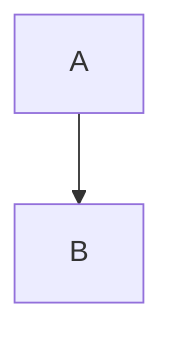
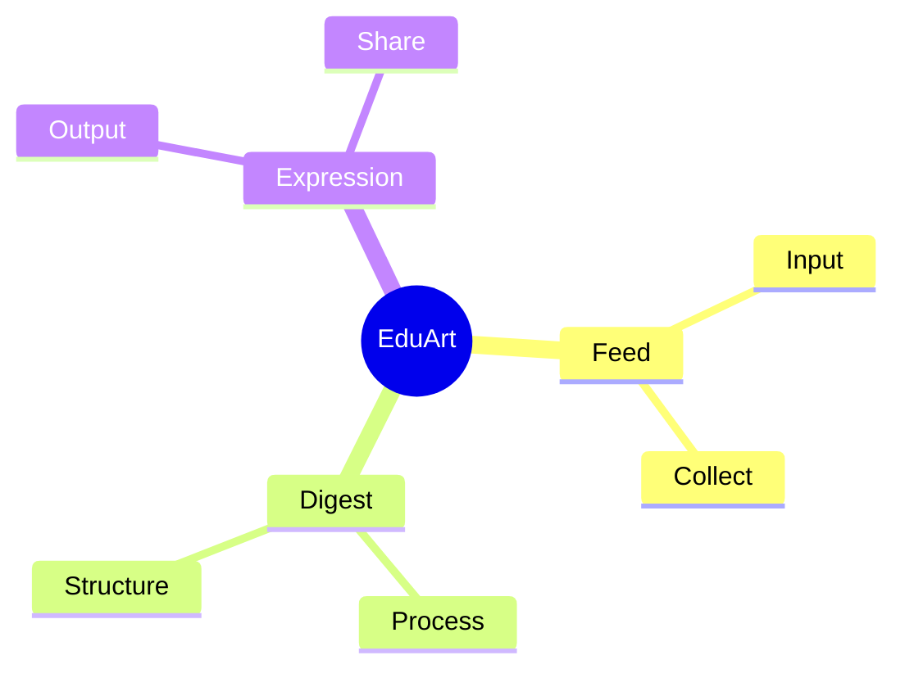
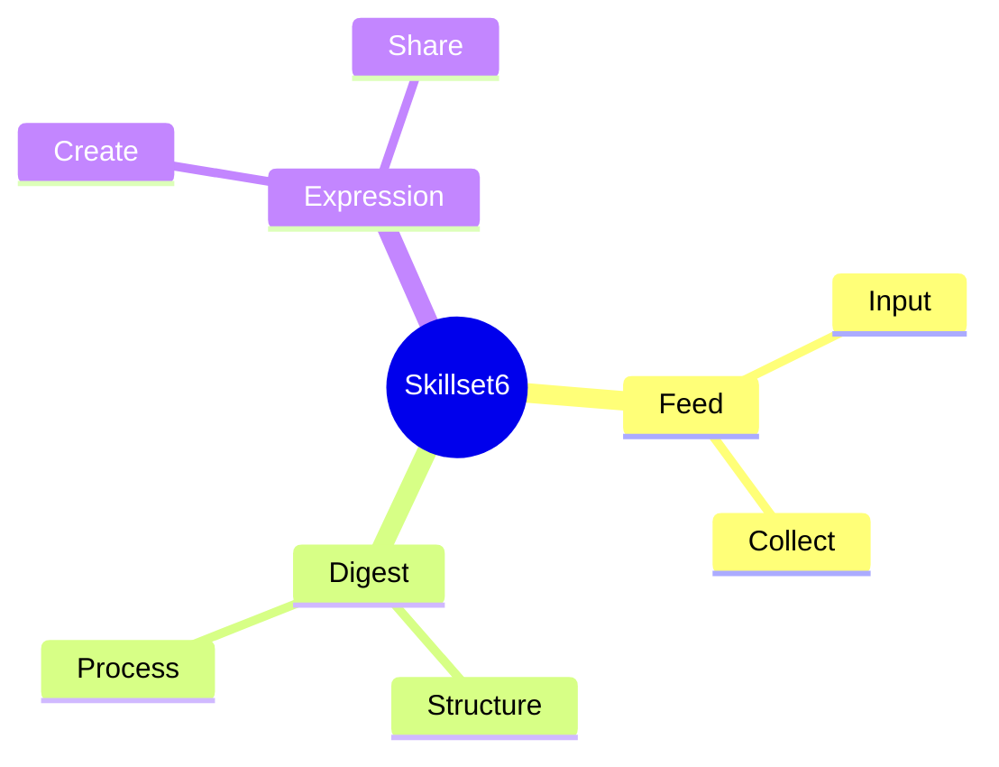

# 🧱 MDX Template Engine Specification (Round 3)

**EAE Skillset6 / EduArt OS – MDX Compilation Rulebook v1.0**

**(Components, Props, MDX Skeleton, Output Rules)**

이것은 박씨 OS의 **"MDX 컴파일 규칙서"**입니다.
ChatGPT/Claude/Agent 전부 이 포맷을 따라야 리포트가 정확하게 생성됩니다.

---

## 목차

1. [MDX 문서 기본 스켈레톤](#1-mdx-문서-기본-스켈레톤-필수-slot-구조)
2. [컴포넌트 스펙](#2-컴포넌트-스펙-정식-규격)
3. [Part별 MDX 작성 규칙](#3-part별-mdx-작성-규칙)
4. [에이전트 출력 형식 규칙](#4-에이전트-출력-형식-규칙-ai가-지켜야-함)
5. [템플릿 골드 샘플](#5-템플릿-골드-샘플-ai가-따라야-할-기준)
6. [3회차의 역할 정리](#6-3회차의-역할-정리)

---

## 1. MDX 문서 기본 스켈레톤 (필수 Slot 구조)

아래는 "최소한의 요소만 넣은 골격"입니다.
모든 리포트는 **이 순서로만 생성**됩니다.

```mdx
---
title: "Report Title"
date: "YYYY-MM-DD"
category: "category-name"
published: true
---

<OpeningFrame 
  videoId="YOUTUBE_ID" 
  title="Intro Title"
/>

# Part 1 – Grandpa Mode
텍스트…

# Part 2 – System Architect Mode
텍스트…

# Part 3 – Theory Map
<Mermaid>
graph TD
  A[Concept] --> B[Concept]
</Mermaid>

<SketchCard 
  src="/images/sample.png"
  caption="One-line caption here"
/>

<SpotifyEmbed track="SPOTIFY_TRACK_ID" />

---

## Prompt Engine
<PromptEngineLink href="https://parksy.kr/prompt-engine/eae-skillset6" />
```

이것이 **전체 Template Engine의 뼈대**입니다.

---

## 2. 컴포넌트 스펙 (정식 규격)

각 컴포넌트가 어떤 props를 가지는지 정의합니다.
이 규격을 박씨가 선언하면 **AI가 일관된 문서를 생산**할 수 있습니다.

---

### 2-1. `<OpeningFrame />`

#### 목적

문서 오프닝 프레임 (YouTube CDN 상단 썸네일)

#### Props

| Prop          | Type   | Required | Description                          |
| ------------- | ------ | -------- | ------------------------------------ |
| `videoId`     | string | Yes      | YouTube 영상 ID                        |
| `title`       | string | Yes      | 썸네일 아래 뜨는 제목                         |
| `description` | string | No       | 간단한 도입 설명 (Part 1에서 풀기 때문에 optional) |

#### 대체 Props (기존 호환성)

| Prop          | Type   | Required | Description                          |
| ------------- | ------ | -------- | ------------------------------------ |
| `src`         | string | Yes*     | YouTube URL (videoId 대신 사용 가능)     |

*Note: `videoId` 또는 `src` 중 하나는 반드시 제공되어야 합니다.

#### MDX 예시

```mdx
<OpeningFrame 
  videoId="abcd1234"
  title="What Is EduArt?"
/>
```

또는

```mdx
<OpeningFrame 
  src="https://www.youtube.com/watch?v=abcd1234"
  title="What Is EduArt?"
/>
```

---

### 2-2. `<SketchCard />`

#### 목적

Excalidraw 느낌의 손그림/보드 컨셉 이미지 삽입

#### Props

| Prop      | Type   | Required | Description          |
| --------- | ------ | -------- | -------------------- |
| `title`   | string | No       | 스케치 제목 (기본: "Sketch") |

#### Children

SVG 코드 또는 이미지를 children으로 전달합니다.

#### 예시

```mdx
<SketchCard title="How concepts circulate inside Skillset6">
  <svg viewBox="0 0 400 300" xmlns="http://www.w3.org/2000/svg">
    <!-- SVG content here -->
  </svg>
</SketchCard>
```

---

### 2-3. `<Mermaid />` (Standalone Component)

#### 목적

학문적/개념적 구조를 도식화 (Proof Layer)

#### 중요한 사용 지침

**표준 리포트에서는:** Part3 내부에서 mermaid 코드블록을 사용하세요 (권장).

```mdx
<Part3>

</Part3>
```

**특수한 경우에만:** 독립적인 Mermaid 다이어그램이 필요한 경우 standalone 컴포넌트 사용.

```mdx
<Mermaid>
graph TD
  A[Concept] --> B[Concept]
</Mermaid>
```

Part3 컴포넌트가 자동으로 mermaid 다이어그램을 렌더링하므로, 대부분의 경우 standalone 컴포넌트는 필요하지 않습니다.

#### 규칙

* 반드시 `graph TD` 또는 `graph LR` 또는 `mindmap`
* Node label은 짧게
* 표준 리포트에서는 Part3 안에 1개만 사용 (mermaid 코드블록으로)

#### 예시 (특수 케이스)

```mdx
<Mermaid>
graph TD
  A[EduArt] --> B[Feed]
  B --> C[Digest]
  C --> D[Expression]
</Mermaid>
```

**참고:** 일반적인 리포트 작성 시에는 Part3의 예시를 따르세요.

---

### 2-4. `<SpotifyEmbed />`

#### 목적

음악 트랙 임베드

#### Props

| Prop    | Type   | Required | Description                |
| ------- | ------ | -------- | -------------------------- |
| `track` | string | Yes      | Spotify track ID 또는 URL    |
| `title` | string | No       | 음악 섹션 제목 (기본: "Music Track") |

#### Track 포맷 지원

- Spotify Track ID: `4uLU6hMCjMI75M1A2tKUQC`
- Spotify URI: `spotify:track:4uLU6hMCjMI75M1A2tKUQC`
- Spotify URL: `https://open.spotify.com/track/4uLU6hMCjMI75M1A2tKUQC`

#### 예시

```mdx
<SpotifyEmbed track="4uLU6hMCjMI75M1A2tKUQC" />
```

또는

```mdx
<SpotifyEmbed 
  track="4uLU6hMCjMI75M1A2tKUQC" 
  title="작업 음악"
/>
```

---

### 2-5. `<PromptEngineLink />`

#### 목적

리포트 생산용 엔진 출구 (필수 컴포넌트)

#### Props

| Prop    | Type   | Required       | Description                           |
| ------- | ------ | -------------- | ------------------------------------- |
| `href`  | string | No             | Prompt Engine URL (기본값 제공)           |
| `title` | string | No             | 포탈 제목 (기본: "Prompt Engine Portal") |

#### 예시

```mdx
<PromptEngineLink href="https://parksy.kr/prompt-engine/eae-skillset6" />
```

또는 (기본값 사용)

```mdx
<PromptEngineLink />
```

---

### 2-6. `<Part1 />`, `<Part2 />`, `<Part3 />`

#### 목적

리포트의 3단계 구조를 나타내는 섹션 컴포넌트

#### Props

없음 (children으로 콘텐츠 전달)

#### 사용법

```mdx
<Part1>
할아버지가 손주에게 이야기하듯...
</Part1>

<Part2>
시스템 아키텍처 설명...
</Part2>

<Part3>

철학적 배경...
</Part3>
```

---

## 3. Part별 MDX 작성 규칙

### Part 1 – Grandpa Mode

#### 목적
비유와 서사를 통한 쉬운 설명

#### 테마 컬러
Amber (#F59E0B)

#### 문장 규칙

* 쉬운 영어 + 비유 중심 (또는 한글로 쉽게)
* 3~4문장 단위로 끊기
* 전문용어 금지
* 실생활 비유 활용
* 스토리텔링 형식

#### 예시

```mdx
<Part1>

## 쉽게 이해하기

상상해보세요. 당신이 레고 블록을 가지고 있습니다...

빨간 블록은 이야기하는 부분이고, 파란 블록은 구조를 설명하는 부분입니다.

이 블록들을 조립하면 하나의 완성된 작품이 탄생합니다!

</Part1>
```

---

### Part 2 – System Architect Mode

#### 목적
시스템 구조와 데이터 흐름 설명

#### 테마 컬러
Blue (#3B82F6)

#### 요소 규칙

* 폴더 구조 표기 가능
* 코드블록 가능
* 테이블 설명 가능
* "입력 → 처리 → 출력" 흐름 유지
* 다이어그램 (ASCII 또는 설명)
* 기술 스택 명시

#### 예시

```mdx
<Part2>

## 시스템 아키텍처

### 데이터 플로우

```
입력: MDX 파일
  ↓
처리: React 컴포넌트 변환
  ↓
출력: 렌더링된 리포트
```

### 기술 스택

- React 18
- Vite
- Tailwind CSS

</Part2>
```

---

### Part 3 – Theory Map

#### 목적
개념 도식화 및 철학적 배경 연결

#### 테마 컬러
Purple (#9333EA)

#### 필수 요소

* Mermaid 다이어그램 1개
* 학자/개념 3~5개 포함
* 철학적 배경 설명 3~6줄
* 개념 간 관계 명확히

#### 예시

```mdx
<Part3>

## Theory Map



### 철학적 배경

이 구조는 레비 스트로스의 구조주의를 따릅니다...

니체의 관점주의처럼 다양한 시각으로 바라봅니다...

푸코의 담론 분석처럼 지식의 생산 메커니즘을 보여줍니다...

</Part3>
```

---

## 4. 에이전트 출력 형식 규칙 (AI가 지켜야 함)

ChatGPT/Claude가 생성할 때 반드시 준수해야 할 룰:

### 🔵 규칙 1: MDX 유효성

**전체 문서는 항상 MDX 유효해야 합니다**

- HTML 태그 섞지 않기
- JSX 문법 준수
- 닫는 태그 반드시 포함
- Children을 받는 컴포넌트는 여는 태그/닫는 태그 사용

### 🔵 규칙 2: 컴포넌트 순서 고정

```
1. Frontmatter (---)
2. OpeningFrame  
3. Part1  
4. Part2  
5. Part3  
6. SketchCard (optional)
7. SpotifyEmbed (optional)
8. PromptEngineLink (REQUIRED)
```

**순서를 절대 바꾸지 마세요.**

### 🔵 규칙 3: 선택적/필수 컴포넌트

**필수:**
- Frontmatter
- OpeningFrame
- Part1
- Part2
- Part3
- PromptEngineLink

**선택적 (있으면 좋음):**
- SketchCard
- SpotifyEmbed

### 🔵 규칙 4: Mermaid 위치

**Mermaid는 반드시 Part3 안에서만 사용**

잘못된 예:
```mdx
<Mermaid>...</Mermaid>  <!-- ❌ 독립 컴포넌트로 사용 불가 -->
```

올바른 예:
```mdx
<Part3>

</Part3>
```

### 🔵 규칙 5: 코드블록 위치

**코드블록은 Part2에서만 등장**

- Part1: 비유와 서사만
- Part2: 코드/구조 설명 가능
- Part3: Mermaid 다이어그램만

### 🔵 규칙 6: 모바일 최적화

**길이는 모바일 기준**

- 문단 3~6줄
- 너무 긴 서술 금지
- 시각적 모듈 중심
- 스크롤 최소화

### 🔵 규칙 7: Frontmatter 필수 항목

```mdx
---
title: "명확한 제목"
date: "YYYY-MM-DD"
category: "카테고리명"
published: true
---
```

**모든 MDX 파일은 반드시 Frontmatter로 시작**

**published 필드:**
- `published: true` - 포스트가 공개되어 리스트와 카운트에 포함됨 (기본값)
- `published: false` - 포스트가 숨겨지고 직접 URL 접근 시 404 반환

---

## 5. 템플릿 "골드 샘플" (AI가 따라야 할 기준)

이것은 "이렇게 생긴 MDX를 만들어라"는 마스터 예시입니다.

```mdx
---
title: "Understanding Skillset6"
date: "2025-12-03"
category: "eae"
published: true
---

<OpeningFrame 
  videoId="abcd1234" 
  title="Understanding Skillset6"
/>

<Part1>

## 쉽게 설명하면?

Think of Skillset6 as six little tools in your backpack.

Each tool helps you shape your ideas differently.

Like a Swiss Army knife for creative thinking!

</Part1>

<Part2>

## 시스템 아키텍처

Skillset6 is processed through three stages:

1. **Feed** – 정보 수집
2. **Digest** – 구조화
3. **Expression** – 표현

```
Input → Processing → Output
  ↓         ↓          ↓
Feed → Digest → Expression
```

### 기술 스택

- MDX for content
- React for components  
- Tailwind for styling

</Part2>

<Part3>

## Theory Map



### 철학적 배경

이 구조는 레비 스트로스의 구조주의에서 영감을 받았습니다.

니체의 관점주의처럼, 여러 시각으로 같은 내용을 바라봅니다.

푸코의 담론 분석처럼, 지식의 생산과 순환을 추적합니다.

</Part3>

<SketchCard title="Skillset6 Flow">
  <svg viewBox="0 0 400 200" xmlns="http://www.w3.org/2000/svg">
    <rect x="50" y="50" width="80" height="60" fill="#F59E0B" rx="5"/>
    <text x="90" y="85" fontSize="14" textAnchor="middle" fill="white">Feed</text>
    
    <rect x="160" y="50" width="80" height="60" fill="#3B82F6" rx="5"/>
    <text x="200" y="85" fontSize="14" textAnchor="middle" fill="white">Digest</text>
    
    <rect x="270" y="50" width="80" height="60" fill="#10B981" rx="5"/>
    <text x="310" y="85" fontSize="14" textAnchor="middle" fill="white">Express</text>
  </svg>
</SketchCard>

<SpotifyEmbed track="3n3Ppam7vgaVa1iaRUc9Lp" title="작업 음악" />

<PromptEngineLink href="https://parksy.kr/prompt-engine/eae-skillset6" />
```

---

## 6. 3회차의 역할 정리

### 세션 구조

1회차 = 구조 (아키텍처)
2회차 = 디자인 (브랜드/CSS)
**3회차 = 실제 MDX 문법 + 컴포넌트 스펙 + 출력 규칙**

### 3회차에서 달성한 것

✅ **MDX 문서 스켈레톤 정의** - 모든 리포트가 따라야 할 구조
✅ **컴포넌트 Props 스펙** - 각 컴포넌트의 정확한 인터페이스
✅ **Part별 작성 규칙** - Grandpa/Architect/Theory 모드별 가이드라인
✅ **AI 출력 규칙** - ChatGPT/Claude가 따라야 할 7가지 규칙
✅ **골드 샘플** - AI가 참고할 완벽한 예시

### 이제 가능한 것

박씨는 이제 어떤 리포트든:

> **"제목 + 핵심 메시지 + Mermaid 아이디어만 던지면
> AI가 자동으로 MDX 완성 → GitHub Pages 배포 가능"**

상태가 되었습니다.

---

## 부록: 컴포넌트 구현 체크리스트

현재 구현된 컴포넌트:

- [x] `OpeningFrame` - `/src/components/mdx/OpeningFrame.jsx`
- [x] `Part1` - `/src/components/mdx/Part1.jsx`
- [x] `Part2` - `/src/components/mdx/Part2.jsx`
- [x] `Part3` - `/src/components/mdx/Part3.jsx` (Mermaid 자동 렌더링)
- [x] `SketchCard` - `/src/components/mdx/SketchCard.jsx`
- [x] `SpotifyEmbed` - `/src/components/mdx/SpotifyEmbed.jsx`
- [x] `PromptEngineLink` - `/src/components/mdx/PromptEngineLink.jsx`

모든 컴포넌트는 `/src/components/mdx/index.js`에서 export되며,
MDXProvider를 통해 모든 MDX 파일에서 사용 가능합니다.

---

**EAE Skillset6 / EduArt OS – MDX Template Engine Specification v1.0**

*This specification is the single source of truth for all MDX report generation.*
