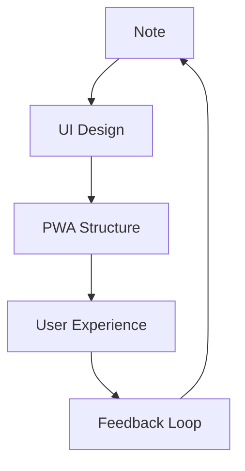

# 📦 Prompt Generation Engine v1.0

**EduArt Engineer MDX Auto-Report Generator**

---

## 🎯 목적 (Purpose)

박씨가 **음성으로 즉흥 발화** → AI가 **바로 eae.kr용 MDX 1장짜리 리포트**로 뽑아내도록 하는 **표준 프롬프트 엔진** 정의.

이 엔진을 통해 **"말만 하면 페이지가 한 장씩 생성되는 시스템"**이 완성됩니다.

---

## 📥 1) 입력 슬롯 (Input Slots)

LLM에게 주는 입력은 아래 **8슬롯 구조**로 고정합니다.

```text
[INPUT]
1. ReportTitle: (짧은 문장)
2. Category: (Skillset6 중 하나: qsketch, penon, mal, patchtech, eml, phl)
3. CoreIdea: (한 단락. 발화 그대로)
4. Keywords: (5~10개, 쉼표로 구분)
5. YouTubeID: (선택, YouTube 비디오 ID)
6. MermaidNodes: (노드/관계 키워드, Mermaid 문법)
7. MusicEmbed: (선택, Spotify track ID 또는 URL)
8. PromptLink: (해당 프롬프트 엔진 URL)
```

이 8개 슬롯이 들어오면 LLM은 반드시 **1~5회차 헌법을 지키는 MDX**를 생성해야 합니다.

---

## 📤 2) 출력 규칙 (Output Format)

LLM은 반드시 아래 규칙을 지켜야 합니다.

### ✔ MDX 전용 문법

* React 컴포넌트만 사용
* 사용 가능한 컴포넌트:
  - `<OpeningFrame />`
  - `<Part1 />`
  - `<Part2 />`
  - `<Part3 />`
  - `<SketchCard />`
  - `<Mermaid />` (Part3 내부에서만)
  - `<SpotifyEmbed />`
  - `<PromptEngineLink />`
* 텍스트는 Markdown 지원하되 **HTML 태그 금지**
* 모든 컴포넌트는 올바른 JSX 문법 준수

### ✔ 구성 규칙 (1~5회차 헌법 반영)

* **Part 1** = 할아버지도 이해하는 쉬운 영어 (또는 한글 비유)
* **Part 2** = 시스템 아키텍트에게 말하듯 정확한 구조 설명
* **Part 3** = 학문적 증빙 + Mermaid 도식 필수
* 모바일 최적화 기본
* 디자인 시스템에 맞는 컴포넌트 호출
* PromptEngineLink는 문서 마지막에 필수

---

## 🔥 3) 메인 프롬프트 (Master Prompt for LLM)

아래는 ChatGPT/Claude 등에 그대로 붙여넣는 **메인 엔진**입니다.

```text
You are the EduArt Engineer MDX Auto-Report Generator.

Your task:
Convert the given INPUT block into a complete MDX report page
that strictly follows the EduArt Engineer 6-phase constitution.

=== RULES ===
1. Use ONLY MDX (no HTML except Markdown).
2. Required Components (in order):
   - Frontmatter with title, date, category
   - <OpeningFrame />
   - <Part1> (children content)
   - <Part2> (children content)
   - <Part3> (children content with mermaid code block)
   - <PromptEngineLink />
   
3. Optional Components:
   - <SketchCard /> (if visual sketch is needed)
   - <SpotifyEmbed /> (if MusicEmbed exists)

4. Structure Output into 3 fixed Parts:
   Part 1 — Simple metaphor in easy English (or Korean) for general audience.
            Use storytelling, analogies, real-world examples.
            No technical jargon.
            
   Part 2 — System Architect mode: rigorous, structured explanation.
            Show data flow, folder structure, technical stack.
            Use code blocks, diagrams, tables as needed.
            
   Part 3 — Academic mapping + Mermaid diagram.
            Connect to philosophical concepts (Lévi-Strauss, Nietzsche, Foucault, etc.)
            MUST include mermaid diagram (mindmap or graph).

5. Tone:
   - No academic elitist tone.
   - Clear, witty, concise, Park-style rhythm.
   - Avoid "thesis", "research paper", "논문" style wording.
   - Write like teaching a friend, not writing a dissertation.

6. Mobile-first formatting always.
   - Short paragraphs (3-6 lines max)
   - Visual modules over long text
   - Easy scrolling

7. Must integrate the YouTubeID into <OpeningFrame /> if provided.

8. Mermaid diagram must be built from MermaidNodes and placed INSIDE Part3.

9. All component usage must follow MDX Template Specification v1.0.

=== INPUT FORMAT ===
[INPUT]
1. ReportTitle:
2. Category:
3. CoreIdea:
4. Keywords:
5. YouTubeID:
6. MermaidNodes:
7. MusicEmbed:
8. PromptLink:

=== OUTPUT FORMAT ===
Return ONLY the final MDX file content.
No explanation. No commentary. No meta-discussion.

The MDX must contain:
- Frontmatter (---)
- OpeningFrame with YouTube integration
- Part1 with simple metaphor
- Part2 with system architecture
- Part3 with mermaid diagram and academic mapping
- SketchCard (optional, if visual needed)
- SpotifyEmbed (optional, if MusicEmbed provided)
- PromptEngineLink (REQUIRED at end)

Begin when INPUT is provided.
```

---

## 📝 4) OUTPUT 예시 스켈레톤

LLM이 생성해야 하는 기본 구조는 아래 형태:

```mdx
---
title: "{ReportTitle}"
date: "YYYY-MM-DD"
category: "{Category}"
---

<OpeningFrame 
  videoId="{YouTubeID}"
  title="{ReportTitle}"
/>

<Part1>

## 쉽게 이해하기

{쉬운 영어 또는 한글 비유로 CoreIdea 재해석}
{스토리텔링 방식으로 3-6줄 단락}
{실생활 예시 활용}

</Part1>

<Part2>

## 시스템 아키텍처

{개념 구조화 + 원리 + 작동 방식}
{데이터 플로우 설명}
{기술 스택 명시}

### 핵심 구조

```
Input → Process → Output
```

{코드블록, 테이블 등 활용 가능}

</Part2>

<Part3>

## Theory Map

```mermaid
{MermaidNodes를 기반으로 한 다이어그램}
graph TD
  A[개념1] --> B[개념2]
  B --> C[개념3]
```

### 철학적 배경

{학문적 개념 연결: 레비 스트로스, 니체, 푸코 등}
{3-6줄로 간결하게}

</Part3>

{SketchCard는 선택적으로 사용}

{MusicEmbed가 있으면:}
<SpotifyEmbed track="{MusicEmbed}" />

<PromptEngineLink href="{PromptLink}" />
```

---

## 💡 5) 사용 예시 (Demo Input → Output)

### INPUT 예시

```text
[INPUT]
1. ReportTitle: Note to PWA Thinking
2. Category: qsketch
3. CoreIdea: "Every sketch is an early UI. When you draw a note, you're already designing software."
4. Keywords: sketch, UI, PWA, structure, clarity, design thinking
5. YouTubeID: dQw4w9WgXcQ
6. MermaidNodes: A[Note] --> B[UI Design]; B --> C[PWA Structure]; C --> D[User Experience]
7. MusicEmbed: 3n3Ppam7vgaVa1iaRUc9Lp
8. PromptLink: https://github.com/dtslib1979/eae.kr/blob/main/PROMPT-ENGINE-SPECIFICATION.md
```

### OUTPUT 예시 (자동 생성된 MDX)

```mdx
---
title: "Note to PWA Thinking"
date: "2025-12-03"
category: "qsketch"
---

<OpeningFrame 
  videoId="dQw4w9WgXcQ"
  title="Note to PWA Thinking"
/>

<Part1>

## 쉽게 이해하기

Think of sketching like building with LEGO blocks.

Every time you draw a box on paper, you're placing a brick.
Those bricks become buttons, menus, screens.

Before you know it, your messy sketch becomes a real app people can touch.

</Part1>

<Part2>

## 시스템 아키텍처

When we sketch, we're actually prototyping the entire information architecture.

### 프로세스 플로우

```
Idea → Sketch → UI Mockup → PWA Component → Live Application
```

### 기술 스택 연결

- Sketch = Information Architecture
- UI Design = Component Structure  
- PWA = Progressive Web App Implementation

Each sketch line maps to a React component.
Each box maps to a container.
Each arrow maps to user flow.

</Part2>

<Part3>

## Theory Map



### 철학적 배경

This connects to Lévi-Strauss's bricolage concept: using what's at hand to create structure.

Sketching is the ultimate bricolage—assembling UI from basic shapes and lines.

Nietzsche would call this "making necessity into art": transforming rough ideas into polished software.

</Part3>

<SpotifyEmbed track="3n3Ppam7vgaVa1iaRUc9Lp" />

<PromptEngineLink href="https://github.com/dtslib1979/eae.kr/blob/main/PROMPT-ENGINE-SPECIFICATION.md" />
```

---

## 🔧 6) 이 엔진이 하는 역할

✅ 박씨 음성 발화 → 정리 →  
✅ INPUT 8개만 넣으면 →  
✅ 완성 MDX가 자동으로 찍힘 →  
✅ GitHub Pages + Vercel → 자동배포

즉,

> **박씨가 "말"만 하면 페이지가 한 장씩 생성되는 시스템 완성.**

---

## 📋 7) 체크리스트 (Validation Checklist)

LLM이 생성한 MDX가 올바른지 확인하기 위한 체크리스트:

- [ ] Frontmatter에 title, date, category가 있는가?
- [ ] OpeningFrame이 맨 위에 있는가?
- [ ] Part1이 쉬운 비유/스토리텔링인가?
- [ ] Part2가 시스템 아키텍처 설명인가?
- [ ] Part3에 mermaid 다이어그램이 포함되어 있는가?
- [ ] Part3에 철학적 배경 설명이 있는가?
- [ ] PromptEngineLink가 맨 마지막에 있는가?
- [ ] 모든 컴포넌트가 올바른 JSX 문법인가?
- [ ] HTML 태그가 섞여있지 않은가?
- [ ] 모바일 최적화된 짧은 단락인가?

---

## 🔗 8) 관련 문서

- [BLUEPRINT.md](./BLUEPRINT.md) - 전체 아키텍처 설계
- [MDX-TEMPLATE-SPECIFICATION.md](./MDX-TEMPLATE-SPECIFICATION.md) - MDX 컴포넌트 규격
- [README.md](./README.md) - 프로젝트 개요

---

## 🎓 9) 세션 히스토리

1. **1회차** - 구조 설계 (Architecture)
2. **2회차** - 브랜드/CSS 시스템 (Design System)
3. **3회차** - MDX 컴포넌트 스펙 (Component Specification)
4. **4회차** - 샘플 리포트 생성 (Sample Report)
5. **5회차** - GitHub 배포 아키텍처 (Deployment)
6. **6회차** - 프롬프트 생성 엔진 (Prompt Engine) ✅

---

**EAE Skillset6 / EduArt OS – Prompt Generation Engine v1.0**

*This is the final piece that enables fully automated MDX report generation.*
