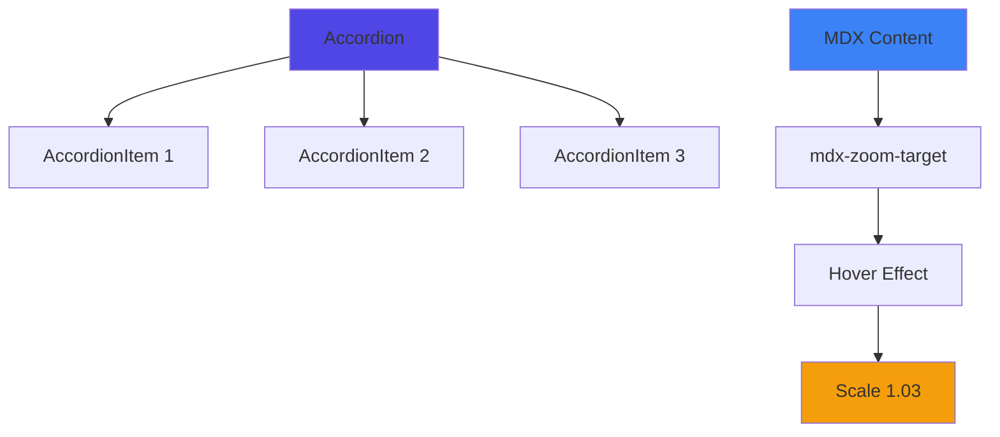

<OpeningFrame 
  videoId="dQw4w9WgXcQ"
  title="Accordion Component Demo"
/>

<Part1>

## Simple Accordion Example

<Accordion title="What is an Accordion?">

An accordion is a UI component that allows you to show and hide content sections. It's perfect for organizing long documents into collapsible sections.

</Accordion>

<Accordion title="Why Use Accordions?">

Accordions help improve readability by:
- Reducing initial page length
- Organizing content into logical sections
- Allowing users to focus on one section at a time

</Accordion>

## Nested AccordionItem Example

<Accordion title="Main Section">

<AccordionItem title="Subsection 1">

This is the content of subsection 1. You can nest AccordionItems inside an Accordion for hierarchical content organization.

</AccordionItem>

<AccordionItem title="Subsection 2">

This is the content of subsection 2. Each AccordionItem works independently.

</AccordionItem>

<AccordionItem title="Subsection 3" defaultOpen={true}>

This subsection is open by default! You can control the initial state with the `defaultOpen` prop.

</AccordionItem>

</Accordion>

</Part1>

<Part2>

<Accordion>

  <AccordionItem title="1. Hover Zoom Feature Overview">

    The `mdx-zoom-target` class adds a subtle zoom effect when you hover over content blocks. This is useful for:

    1. **Focus Enhancement** - Drawing attention to the section being read
    2. **Readability on Projectors/Tablets** - Slight magnification helps with visibility
    3. **Interactive Feedback** - Gives visual feedback that content is interactive

  </AccordionItem>

  <AccordionItem title="2. Example Implementation">

    <div className="mdx-zoom-target p-4 bg-slate-800 rounded-lg my-4">

    ### Example Zoom Block

    Hover over this entire block to see the zoom effect! The content will scale to 1.03x after a 0.45s delay, creating a smooth, subtle emphasis.

    This is perfect for long-form content where you want to highlight sections without being distracting.

    </div>

    <div className="mdx-zoom-target p-4 bg-slate-700 rounded-lg my-4">

    ### Another Zoom Example

    Try hovering over different sections to see how the effect works. The delay prevents accidental triggers when scrolling.

    **Recommended scale range:** 1.02 - 1.04 for subtle, professional effect

    </div>

  </AccordionItem>

  <AccordionItem title="3. Technical Details">

    ```jsx
    // CSS Implementation
    .mdx-zoom-target {
      transition: transform 0.22s ease-out 0.45s;
      cursor: default;
    }

    .mdx-zoom-target:hover {
      transform: scale(1.03);
    }
    ```

  </AccordionItem>

</Accordion>

</Part2>

<Part3>

## Component Architecture



### Design Philosophy

The accordion pattern follows **progressive disclosure** principles - showing users only what they need, when they need it.

The hover zoom effect implements **visual feedback** theory - providing subtle cues that enhance user experience without overwhelming the interface.

Both features together create a **reader-friendly** environment for long-form educational content.

</Part3>

<PromptEngineLink />
