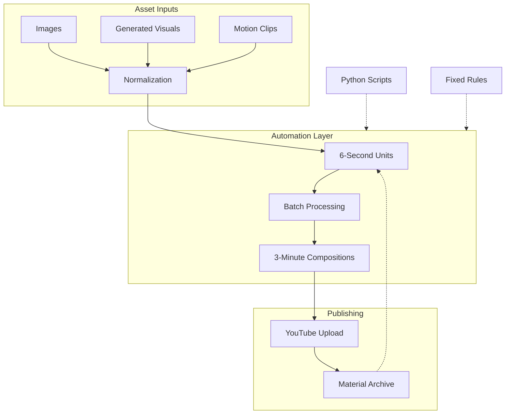

<OpeningFrame videoId="ArreO-I40ns" />

<Part1>

## In Simple Terms

Think of this as a video LEGO factory.

Most creators edit videos one by one. They spend hours on timelines, adding effects, fixing transitions.

I don't.

I treat AI-generated clips as **raw materials**—not finished products. Six seconds each. Cheap to make, easy to throw away.

Then I stack them. Automatically. Python scripts do the assembly. No timeline dragging.

The result? A YouTube channel that grows itself. Every upload is a reusable brick. Every brick can become part of something bigger.

This is not video editing.
This is **material architecture**.

</Part1>

<Part2>

## System Architecture

<Accordion>

<AccordionItem title="1. Channel as Archive">

The channel is not a portfolio. It is a **source library**.

Every video uploaded becomes:
- A reusable asset
- A building block for future content
- Part of a searchable material database

No video is "done." Every video is "available."

</AccordionItem>

<AccordionItem title="2. Six-Second Units">

The atomic unit is 6 seconds.

Why 6 seconds?
- Short enough to generate cheaply
- Long enough to contain one idea
- Perfect for batch processing

These units are **fragments**, not content. They wait to be assembled.

</AccordionItem>

<AccordionItem title="3. Three-Minute Compositions">

Multiple 6-second units combine into 3-minute videos.

Rules:
- Fixed sequence patterns
- No manual timeline editing
- Deterministic output

Given the same inputs, you always get the same video.

</AccordionItem>

<AccordionItem title="4. Automation Pipeline">

Python handles everything:
- Asset normalization (size, framerate, duration)
- Batch generation
- Export to multiple formats

One command = dozens of videos.

No GPU theater. No face-swapping roulette. Just reproducible output.

</AccordionItem>

<AccordionItem title="5. Publishing Flow">

1. Prepare assets
2. Run batch scripts
3. Upload to YouTube
4. Videos become reusable for next cycle

The archive grows. Manual work stays flat.

</AccordionItem>

</Accordion>

</Part2>

<Part3>

## Concept Map

## Theoretical Background

### Editing as Transformation

Traditional editing = creative decisions at every step.
This system = creative decisions only at asset creation.

Assembly is **mechanical**. Rules are **fixed**. Output is **deterministic**.

| Stage | Decision Maker |
|-------|----------------|
| Asset Creation | Human + AI |
| Normalization | System |
| Assembly | System |
| Publishing | System |

### The Archive Mindset

Every upload is an investment, not a finished product.

The channel is not measured by views per video.
It is measured by **total reusable materials**.

### Beyond AI

Externally, this looks like "AI content."
Internally, AI is just the material supplier.

**AI generates. Humans curate. Systems assemble.**

This is not #WithAI.
This is **#BeyondAI**.

---

> Want to try this structure? Start with one 6-second unit. Stack from there.

</Part3>
