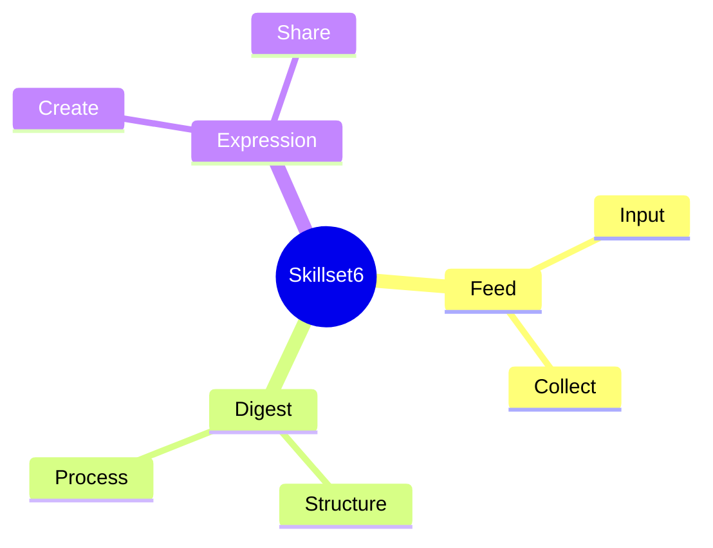

<OpeningFrame 
  videoId="abcd1234" 
  title="Understanding Skillset6"
/>

<Part1>

## 쉽게 설명하면?

Think of Skillset6 as six little tools in your backpack.

Each tool helps you shape your ideas differently.

Like a Swiss Army knife for creative thinking!

</Part1>

<Part2>

<Accordion>

  <AccordionItem title="1. System Overview">
    
    Skillset6 is processed through three stages that transform raw input into structured, 
    meaningful expression.

  </AccordionItem>

  <AccordionItem title="2. Data Flow">

    ```
    Input → Processing → Output
      ↓         ↓          ↓
    Feed → Digest → Expression
    ```

    The three-stage pipeline ensures consistent transformation from unstructured ideas 
    to polished creative output.

  </AccordionItem>

  <AccordionItem title="3. Tech Stack">

    - **MDX** for content authoring
    - **React** for component rendering
    - **Tailwind** for styling system

  </AccordionItem>

</Accordion>

</Part2>

<Part3>

## Theory Map



### 철학적 배경

이 구조는 레비 스트로스의 구조주의에서 영감을 받았습니다.

니체의 관점주의처럼, 여러 시각으로 같은 내용을 바라봅니다.

푸코의 담론 분석처럼, 지식의 생산과 순환을 추적합니다.

</Part3>

<SketchCard title="Skillset6 Flow">
  <svg viewBox="0 0 400 200" xmlns="http://www.w3.org/2000/svg">
    <rect x="50" y="50" width="80" height="60" fill="#F59E0B" rx="5"/>
    <text x="90" y="85" fontSize="14" textAnchor="middle" fill="white">Feed</text>
    
    <rect x="160" y="50" width="80" height="60" fill="#3B82F6" rx="5"/>
    <text x="200" y="85" fontSize="14" textAnchor="middle" fill="white">Digest</text>
    
    <rect x="270" y="50" width="80" height="60" fill="#10B981" rx="5"/>
    <text x="310" y="85" fontSize="14" textAnchor="middle" fill="white">Express</text>
  </svg>
</SketchCard>

<SpotifyEmbed track="3n3Ppam7vgaVa1iaRUc9Lp" title="작업 음악" />

<PromptEngineLink href="https://parksy.kr/prompt-engine/eae-skillset6" />
