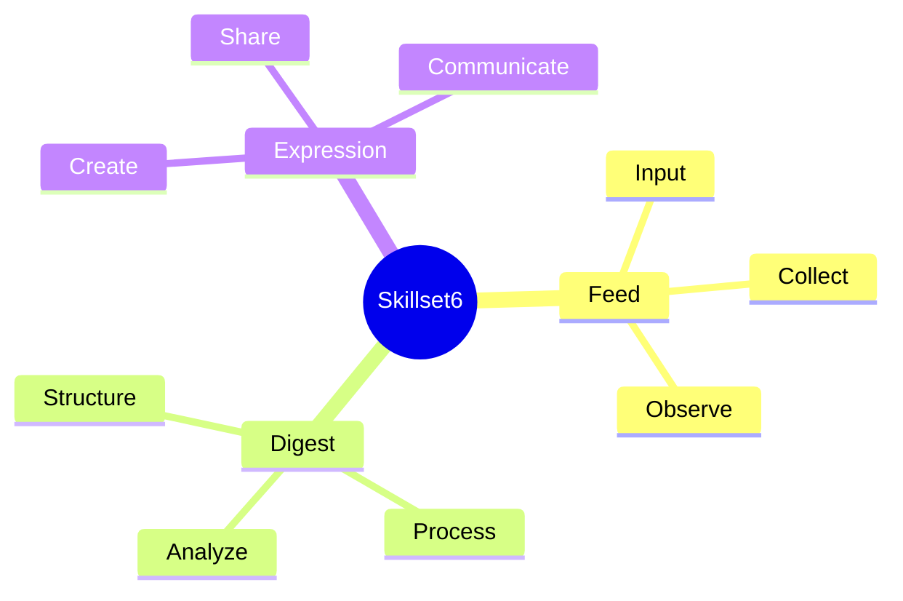

<OpeningFrame 
  videoId="abcd1234" 
  title="Understanding Skillset6"
/>

<Part1>

## 쉽게 설명하면?

Think of Skillset6 as six little tools in your backpack.

Each tool helps you shape your ideas differently.

Like a Swiss Army knife for creative thinking!

When you need to organize thoughts, one tool appears. When you need to express visually, another tool helps.

Together, they form a complete thinking system.

</Part1>

<Part2>

## 시스템 아키텍처

Skillset6 is processed through three stages:

1. **Feed** – 정보 수집 및 입력
2. **Digest** – 구조화 및 처리
3. **Expression** – 결과 표현 및 공유

### 데이터 플로우

```
입력 (Input) → 처리 (Processing) → 출력 (Output)
     ↓                ↓                 ↓
   Feed          Digest          Expression
```

### 기술 스택

- **MDX**: Markdown + JSX for content authoring
- **React**: Component-based UI rendering  
- **Tailwind CSS**: Utility-first styling
- **Mermaid**: Diagram visualization
- **Vite**: Fast build tooling

### 구조적 특징

The MDX file acts as the input node, transformed by React into interactive components, styled with Tailwind, and deployed through GitHub Pages.

</Part2>

<Part3>

## Theory Map



### 철학적 배경

이 구조는 **레비 스트로스의 구조주의**에서 영감을 받았습니다. 신화를 분석하듯이, 우리는 지식을 구조화하고 패턴을 찾습니다.

**니체의 관점주의**처럼, 같은 내용을 여러 시각(Grandpa Mode, Architect Mode, Theory Map)으로 바라봅니다. 하나의 진리가 아닌 다층적 이해를 추구합니다.

**푸코의 담론 분석**처럼, 각 리포트는 지식이 생산되고 순환하는 메커니즘입니다. 정보의 흐름과 권력 구조를 드러냅니다.

</Part3>

<SketchCard title="Skillset6 Flow Diagram">
  <svg viewBox="0 0 400 200" xmlns="http://www.w3.org/2000/svg">
    <rect x="50" y="50" width="80" height="60" fill="#F59E0B" stroke="#D97706" strokeWidth="2" rx="5"/>
    <text x="90" y="85" fontSize="14" textAnchor="middle" fill="white" fontWeight="bold">Feed</text>
    
    <rect x="160" y="50" width="80" height="60" fill="#3B82F6" stroke="#2563EB" strokeWidth="2" rx="5"/>
    <text x="200" y="85" fontSize="14" textAnchor="middle" fill="white" fontWeight="bold">Digest</text>
    
    <rect x="270" y="50" width="80" height="60" fill="#10B981" stroke="#059669" strokeWidth="2" rx="5"/>
    <text x="310" y="85" fontSize="14" textAnchor="middle" fill="white" fontWeight="bold">Express</text>
    
    <path d="M 130 80 L 160 80" stroke="#6B7280" strokeWidth="2" markerEnd="url(#arrow)"/>
    <path d="M 240 80 L 270 80" stroke="#6B7280" strokeWidth="2" markerEnd="url(#arrow)"/>
    
    <defs>
      <marker id="arrow" markerWidth="10" markerHeight="10" refX="9" refY="3" orient="auto">
        <polygon points="0 0, 10 3, 0 6" fill="#6B7280" />
      </marker>
    </defs>
    
    <text x="145" y="70" fontSize="10" fill="#6B7280">→</text>
    <text x="255" y="70" fontSize="10" fill="#6B7280">→</text>
    
    <text x="200" y="170" fontSize="16" textAnchor="middle" fill="#374151" fontWeight="bold">
      Three-Stage Processing Flow
    </text>
  </svg>
</SketchCard>

<SpotifyEmbed track="3n3Ppam7vgaVa1iaRUc9Lp" title="작업 음악: 집중할 때 듣기 좋은 음악" />

<PromptEngineLink href="https://parksy.kr/prompt-engine/eae-skillset6" />
