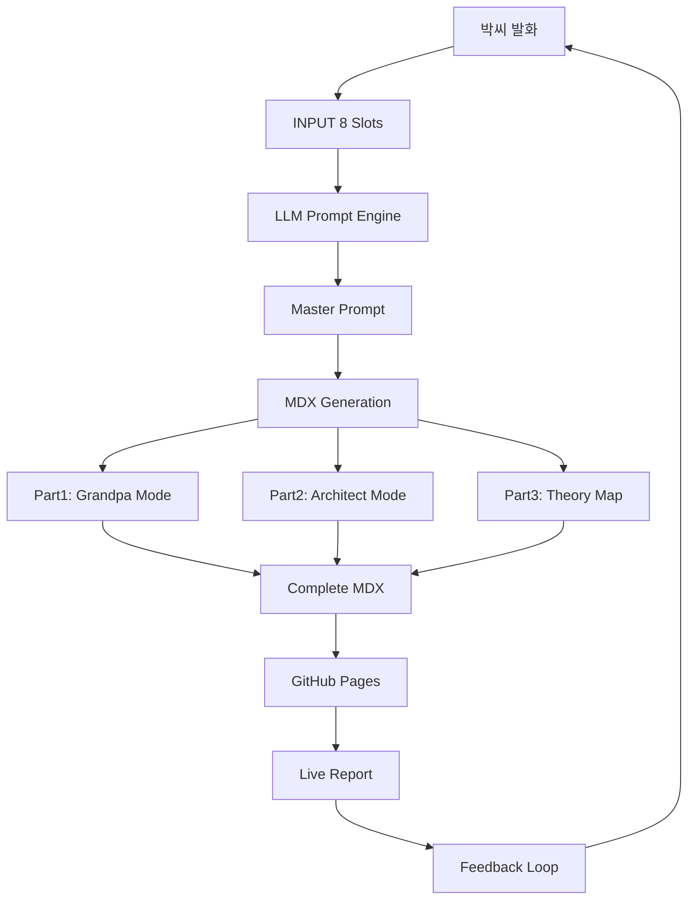

<OpeningFrame 
  videoId="dQw4w9WgXcQ" 
  title="Prompt Generation Engine v1.0"
/>

<Part1>

## 말만 하면 페이지가 생성된다?

상상해보세요. 박씨가 아침에 커피를 마시며 아이디어를 말합니다.

"오늘은 노트 필기가 사실 UI 디자인이라는 걸 설명하고 싶어."

그러면 AI가 귀를 쫑긋 세우고 듣습니다. 8가지 정보만 물어봅니다:

1. 제목이 뭐예요? 
2. 어느 카테고리예요?
3. 핵심 아이디어를 한 문장으로?
4. 키워드 5개만?
5. 유튜브 영상 있어요?
6. 다이어그램은 어떤 구조로?
7. 음악 추천 있으면?
8. 프롬프트 엔진 링크는?

박씨가 대답하면, **5분 뒤 완성된 MDX 리포트 한 장이 튀어나옵니다.** 

마치 레시피 카드에 재료만 적으면 셰프가 요리를 완성해주는 것처럼!

</Part1>

<Part2>

## 시스템 아키텍처: 엔진의 작동 원리

### INPUT 슬롯 구조 (8개 고정)

```javascript
const INPUT = {
  ReportTitle: "짧은 문장",
  Category: "qsketch | penon | mal | patchtech | eml | phl",
  CoreIdea: "한 단락 발화 그대로",
  Keywords: ["키워드1", "키워드2", "..."],
  YouTubeID: "optional_video_id",
  MermaidNodes: "A[Node] --> B[Node]",
  MusicEmbed: "optional_spotify_track_id",
  PromptLink: "https://prompt-engine-url"
}
```

### OUTPUT 구조 (MDX 자동 생성)

```
입력 8슬롯
    ↓
LLM Prompt Engine
    ↓
MDX 문서 생성
    ↓
- Frontmatter (title, date, category)
- OpeningFrame (YouTube 임베드)
- Part1 (할아버지 모드 - 쉬운 비유)
- Part2 (아키텍트 모드 - 구조 설명)
- Part3 (이론 지도 - Mermaid + 철학)
- SketchCard (선택)
- SpotifyEmbed (선택)
- PromptEngineLink (필수)
    ↓
GitHub Pages 자동 배포
```

### 프롬프트 엔진 핵심 규칙

1. **MDX Only** - HTML 태그 금지, React 컴포넌트만
2. **3 Parts 고정** - Grandpa/Architect/Theory 순서
3. **모바일 최적화** - 짧은 단락 (3-6줄)
4. **Mermaid 필수** - Part3에 다이어그램 포함
5. **톤 통제** - 논문 스타일 금지, 친구에게 말하듯
6. **컴포넌트 순서** - Frontmatter → Opening → Parts → Links

### 기술 스택 통합

- **LLM**: ChatGPT/Claude가 프롬프트 엔진 실행
- **MDX**: 생성된 콘텐츠 포맷
- **React**: 컴포넌트 렌더링
- **Vite**: 빌드 시스템
- **GitHub Actions**: 자동 배포

</Part2>

<Part3>

## Theory Map: 자동화의 철학



### 철학적 배경

이 프롬프트 엔진은 **자동화(Automation)**와 **구조화(Structuring)**의 균형을 추구합니다.

니체가 말했듯 "예술가는 필연을 아름다움으로 만든다." 프롬프트 엔진은 필연적 규칙(8 slots, 3 parts)을 아름다운 리포트로 변환합니다.

레비 스트로스의 **브리콜라주(Bricolage)** 개념처럼, 제한된 요소(컴포넌트)로 무한한 조합(리포트)을 만듭니다.

푸코의 **지식의 고고학(Archaeology of Knowledge)**처럼, 각 리포트는 지식이 생성되고 순환하는 담론 장치입니다.

이 엔진의 핵심은 **"제약이 창의성을 만든다"**는 역설입니다. 8개 슬롯과 3개 파트라는 제약이 오히려 일관되고 강력한 콘텐츠를 만들어냅니다.

</Part3>

<SketchCard title="Prompt Engine 데이터 플로우">
  <svg viewBox="0 0 500 400" xmlns="http://www.w3.org/2000/svg" style={{width: '100%', height: 'auto'}}>
    {/* 박씨 발화 */}
    <circle cx="50" cy="50" r="30" fill="#F59E0B" stroke="#D97706" strokeWidth="2"/>
    <text x="50" y="55" fontSize="12" textAnchor="middle" fill="white" fontWeight="bold">발화</text>
    
    {/* INPUT 슬롯 */}
    <rect x="120" y="30" width="80" height="40" fill="#4F46E5" stroke="#4338CA" strokeWidth="2" rx="5"/>
    <text x="160" y="55" fontSize="12" textAnchor="middle" fill="white" fontWeight="bold">8 Slots</text>
    
    {/* LLM */}
    <rect x="240" y="20" width="100" height="60" fill="#7C3AED" stroke="#6D28D9" strokeWidth="2" rx="5"/>
    <text x="290" y="45" fontSize="12" textAnchor="middle" fill="white" fontWeight="bold">LLM</text>
    <text x="290" y="62" fontSize="10" textAnchor="middle" fill="white">Prompt</text>
    
    {/* MDX Parts */}
    <rect x="380" y="10" width="90" height="30" fill="#10B981" stroke="#059669" strokeWidth="2" rx="3"/>
    <text x="425" y="28" fontSize="11" textAnchor="middle" fill="white">Part1</text>
    
    <rect x="380" y="50" width="90" height="30" fill="#3B82F6" stroke="#2563EB" strokeWidth="2" rx="3"/>
    <text x="425" y="68" fontSize="11" textAnchor="middle" fill="white">Part2</text>
    
    <rect x="380" y="90" width="90" height="30" fill="#9333EA" stroke="#7E22CE" strokeWidth="2" rx="3"/>
    <text x="425" y="108" fontSize="11" textAnchor="middle" fill="white">Part3</text>
    
    {/* MDX */}
    <rect x="380" y="140" width="90" height="40" fill="#EF4444" stroke="#DC2626" strokeWidth="2" rx="5"/>
    <text x="425" y="165" fontSize="12" textAnchor="middle" fill="white" fontWeight="bold">MDX</text>
    
    {/* GitHub Pages */}
    <rect x="360" y="200" width="130" height="50" fill="#1F2937" stroke="#111827" strokeWidth="2" rx="5"/>
    <text x="425" y="220" fontSize="12" textAnchor="middle" fill="white" fontWeight="bold">GitHub</text>
    <text x="425" y="237" fontSize="11" textAnchor="middle" fill="white">Auto Deploy</text>
    
    {/* Live Report */}
    <circle cx="425" cy="300" r="35" fill="#10B981" stroke="#059669" strokeWidth="3"/>
    <text x="425" y="295" fontSize="11" textAnchor="middle" fill="white" fontWeight="bold">Live</text>
    <text x="425" y="310" fontSize="11" textAnchor="middle" fill="white">Report</text>
    
    {/* Arrows */}
    <path d="M 80 50 L 120 50" stroke="#6B7280" strokeWidth="2" fill="none" markerEnd="url(#arrow)"/>
    <path d="M 200 50 L 240 50" stroke="#6B7280" strokeWidth="2" fill="none" markerEnd="url(#arrow)"/>
    <path d="M 340 30 L 380 25" stroke="#6B7280" strokeWidth="2" fill="none" markerEnd="url(#arrow)"/>
    <path d="M 340 50 L 380 65" stroke="#6B7280" strokeWidth="2" fill="none" markerEnd="url(#arrow)"/>
    <path d="M 340 70 L 380 105" stroke="#6B7280" strokeWidth="2" fill="none" markerEnd="url(#arrow)"/>
    <path d="M 425 120 L 425 140" stroke="#6B7280" strokeWidth="2" fill="none" markerEnd="url(#arrow)"/>
    <path d="M 425 180 L 425 200" stroke="#6B7280" strokeWidth="2" fill="none" markerEnd="url(#arrow)"/>
    <path d="M 425 250 L 425 265" stroke="#6B7280" strokeWidth="2" fill="none" markerEnd="url(#arrow)"/>
    
    {/* Feedback loop */}
    <path d="M 390 300 Q 200 350, 50 80" stroke="#F59E0B" strokeWidth="2" fill="none" strokeDasharray="5,5" markerEnd="url(#arrow-orange)"/>
    
    <defs>
      <marker id="arrow" markerWidth="10" markerHeight="10" refX="9" refY="3" orient="auto">
        <polygon points="0 0, 10 3, 0 6" fill="#6B7280" />
      </marker>
      <marker id="arrow-orange" markerWidth="10" markerHeight="10" refX="9" refY="3" orient="auto">
        <polygon points="0 0, 10 3, 0 6" fill="#F59E0B" />
      </marker>
    </defs>
    
    <text x="250" y="380" fontSize="14" textAnchor="middle" fill="#374151" fontWeight="bold">
      Prompt Generation Engine v1.0
    </text>
  </svg>
</SketchCard>

<SpotifyEmbed track="3n3Ppam7vgaVa1iaRUc9Lp" title="프롬프트 엔진 개발 음악" />

<PromptEngineLink href="https://github.com/dtslib1979/eae.kr/blob/main/PROMPT-ENGINE-SPECIFICATION.md" />
