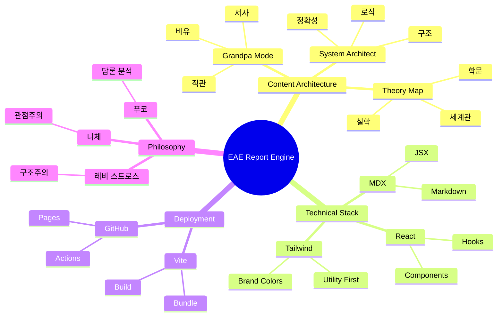

<OpeningFrame 
  videoId="dQw4w9WgXcQ" 
  title="EAE Blueprint Introduction"
/>

<Part1>

## 박씨의 리포트 엔진을 쉽게 설명하면?

상상해보세요. 당신이 레고 블록을 가지고 있습니다. 각 블록은 특별한 색깔과 모양을 가지고 있어요.

빨간 블록은 **"할아버지가 손주에게 이야기하듯 쉽게 설명하는 부분"**입니다. 마치 옛날이야기를 듣듯이, 복잡한 개념을 비유와 서사로 풀어냅니다.

파란 블록은 **"건축가가 설계도를 그리듯 정확하게 설명하는 부분"**입니다. 시스템이 어떻게 작동하는지, 데이터가 어떻게 흐르는지 명확하게 보여줍니다.

보라색 블록은 **"세계관의 지도를 그리는 부분"**입니다. 철학자들의 생각, 학문적 배경, 개념들의 관계를 도식으로 표현합니다.

이 모든 블록을 조립하면, 하나의 완성된 리포트가 탄생합니다. 그리고 이 리포트는 강의가 될 수도, 교재가 될 수도, 블로그 포스트가 될 수도 있습니다!

</Part1>

<Part2>

<Accordion>

  <AccordionItem title="1. Universal Structure">

    EAE 리포트 엔진은 다음과 같은 컴포넌트 기반 아키텍처를 따릅니다:

    ```
    리포트 구조:
    ┌─────────────────────────────────────┐
    │ OpeningFrame (미디어 프레임)          │
    ├─────────────────────────────────────┤
    │ Part1: Grandpa Mode                 │
    │ - 비유와 서사                         │
    │ - 단순화된 설명                       │
    ├─────────────────────────────────────┤
    │ Part2: System Architect Mode        │
    │ - 구조와 로직                         │
    │ - 데이터 흐름                         │
    ├─────────────────────────────────────┤
    │ Part3: Theory Map                   │
    │ - Mermaid 다이어그램                 │
    │ - 개념 관계도                         │
    ├─────────────────────────────────────┤
    │ SketchCard (자유 그림)               │
    ├─────────────────────────────────────┤
    │ SpotifyEmbed (음악 연계)             │
    ├─────────────────────────────────────┤
    │ PromptEngineLink (재생산 포탈)       │
    └─────────────────────────────────────┘
    ```

  </AccordionItem>

  <AccordionItem title="2. Tech Stack">

    - **MDX**: Markdown + JSX = 컴포넌트 기반 콘텐츠
    - **React**: 동적 UI 렌더링
    - **Tailwind CSS**: 브랜드 컬러/타이포그래피 적용
    - **Vite**: 빌드 및 번들링
    - **GitHub Pages**: 자동 배포

  </AccordionItem>

  <AccordionItem title="3. Data Flow Pipeline">

    1. **입력**: MDX 파일 작성 (콘텐츠 + 컴포넌트)
    2. **변환**: MDX → React 컴포넌트
    3. **렌더링**: MDXProvider가 컴포넌트 주입
    4. **스타일링**: Tailwind가 브랜드 스타일 적용
    5. **배포**: GitHub Actions가 자동 빌드 & 배포

  </AccordionItem>

</Accordion>

</Part2>

<Part3>

## Theory Map: 개념의 세계관



### 철학적 배경

이 엔진은 **구조주의(Structuralism)**의 영향을 받았습니다. 레비 스트로스가 신화를 분석하듯, 우리는 지식을 구조화합니다.

니체의 **관점주의(Perspectivism)**처럼, 같은 내용을 세 가지 모드(Grandpa, Architect, Theory)로 바라봅니다.

푸코의 **담론 분석(Discourse Analysis)**처럼, 각 리포트는 지식이 생산되고 순환하는 메커니즘입니다.

</Part3>

<SketchCard title="리포트 엔진 개념도">
  <svg viewBox="0 0 400 300" xmlns="http://www.w3.org/2000/svg" style={{width: '100%', height: 'auto'}}>
    <rect x="20" y="20" width="100" height="60" fill="#F59E0B" stroke="#D97706" strokeWidth="2" rx="5"/>
    <text x="70" y="55" fontSize="14" textAnchor="middle" fill="white" fontWeight="bold">MDX</text>
    
    <rect x="150" y="80" width="100" height="60" fill="#4F46E5" stroke="#4338CA" strokeWidth="2" rx="5"/>
    <text x="200" y="115" fontSize="14" textAnchor="middle" fill="white" fontWeight="bold">Engine</text>
    
    <rect x="280" y="20" width="100" height="40" fill="#10B981" stroke="#059669" strokeWidth="2" rx="5"/>
    <text x="330" y="45" fontSize="12" textAnchor="middle" fill="white">강의</text>
    
    <rect x="280" y="70" width="100" height="40" fill="#10B981" stroke="#059669" strokeWidth="2" rx="5"/>
    <text x="330" y="95" fontSize="12" textAnchor="middle" fill="white">교재</text>
    
    <rect x="280" y="120" width="100" height="40" fill="#10B981" stroke="#059669" strokeWidth="2" rx="5"/>
    <text x="330" y="145" fontSize="12" textAnchor="middle" fill="white">블로그</text>
    
    <rect x="280" y="170" width="100" height="40" fill="#10B981" stroke="#059669" strokeWidth="2" rx="5"/>
    <text x="330" y="195" fontSize="12" textAnchor="middle" fill="white">PWA</text>
    
    <path d="M 120 50 L 150 110" stroke="#6B7280" strokeWidth="2" fill="none" markerEnd="url(#arrowhead)"/>
    <path d="M 250 110 L 280 40" stroke="#6B7280" strokeWidth="2" fill="none" markerEnd="url(#arrowhead)"/>
    <path d="M 250 110 L 280 90" stroke="#6B7280" strokeWidth="2" fill="none" markerEnd="url(#arrowhead)"/>
    <path d="M 250 110 L 280 140" stroke="#6B7280" strokeWidth="2" fill="none" markerEnd="url(#arrowhead)"/>
    <path d="M 250 110 L 280 190" stroke="#6B7280" strokeWidth="2" fill="none" markerEnd="url(#arrowhead)"/>
    
    <defs>
      <marker id="arrowhead" markerWidth="10" markerHeight="10" refX="9" refY="3" orient="auto">
        <polygon points="0 0, 10 3, 0 6" fill="#6B7280" />
      </marker>
    </defs>
    
    <text x="200" y="270" fontSize="16" textAnchor="middle" fill="#374151" fontWeight="bold">
      Universal Report Template Engine
    </text>
  </svg>
</SketchCard>

<SpotifyEmbed track="3n3Ppam7vgaVa1iaRUc9Lp" title="작업 중 듣기 좋은 음악" />

<PromptEngineLink href="https://parksy.kr/prompt-engine/eae-skillset6" />
