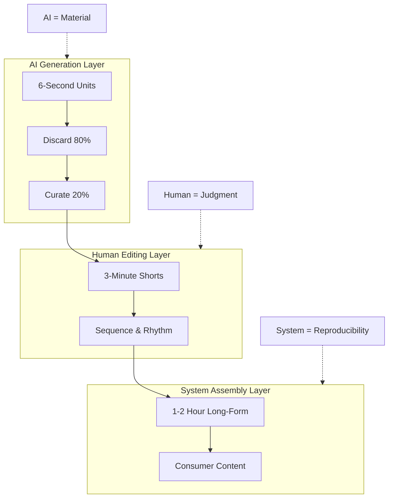

<Part1>

## In Simple Terms

Think of AI video like LEGO blocks.

Most people try to build a castle in one shot — they burn GPUs, swap faces, chase spectacle, and lose control.

I don't.

I start with **6-second blocks**. Small, cheap, disposable.

Why? Because at 6 seconds, AI stays a **material**, not a decision-maker.

I generate hundreds. Throw away 80%. Keep only what triggers my judgment.

Then I stack them. 6 seconds → 3 minutes → 1 hour.

This is not "AI video production."
This is **unit-based assembly**.

</Part1>

<Part2>

## System Architecture

<Accordion>

<AccordionItem title="1. The Platform Reality">

YouTube is a video-only platform. No video, no entry.

But:
- Human-only video = labor hell
- Fully AI video = lottery + zero control

So I split the roles:

| Role | Owner |
|------|-------|
| Generate materials | AI |
| Judge and select | Human |
| Assemble content | System |

</AccordionItem>

<AccordionItem title="2. The 6-Second Unit Layer">

A 6-second AI video is not content. It is a **Unit**.

Why units?
- Cheap to generate
- Easy to discard
- Easy to curate
- Scalable without regret

At this stage:
- AI makes no decisions
- Humans only observe and select

Units are stored as **Playlists = Categories**:
- Design
- Nature
- Rhythm
- Cliché
- Mood

This is **Visual Literacy Dataset** — pre-tutorial education.

</AccordionItem>

<AccordionItem title="3. The 3-Minute Editing Layer">

When units accumulate, humans enter.

Decisions at this layer:
- Which unit survives
- In what order
- With what rhythm
- Where to cut, loop, or stop

This is **directing meaning in time**.

I am not an AI artist here. I am a **Video Director**.

</AccordionItem>

<AccordionItem title="4. The Long-Form Assembly Layer">

Long-form videos (1–2 hours) come last.

Built from:
- 6-second units
- 3-minute shorts

Assembled locally with:
- Python automation
- ffmpeg
- Deterministic pipelines

No face swapping. No GPU theater. No regeneration roulette.

Long videos are **consumer products**, not creative sources.

</AccordionItem>

</Accordion>

</Part2>

<Part3>

## Concept Map

## Theoretical Background

### Beyond AI, Not With AI

Externally, this looks like "With AI."
Internally, it is not.

| Principle | Implementation |
|-----------|----------------|
| AI never decides | Raw material only |
| Humans always judge | Curation at every layer |
| Systems guarantee repeatability | Deterministic pipelines |

AI is reduced to **raw material**. This is why the correct label is not "With AI" but **Beyond AI**.

### The EduArt Engineer Axis

This channel trains three axes simultaneously:

| Axis | Focus |
|------|-------|
| **Art** | Sensory judgment and selection |
| **Engineer** | Structure, automation, reproducibility |
| **Education** | Transferable thinking systems |

This is not about learning tools. It is about learning **how to think with AI without surrendering control**.

### Final Position

> This is not AI content creation.
> This is **AI material direction**.

</Part3>
