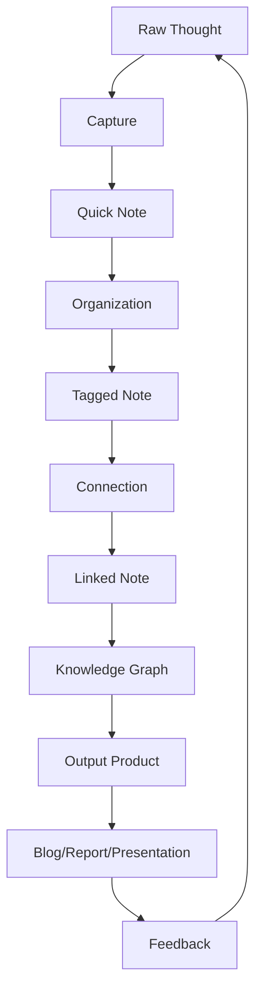

<OpeningFrame 
  videoId="dQw4w9WgXcQ"
  title="The Art of Digital Note-Taking"
/>

<Part1>

## 쉽게 이해하기

Imagine your notebook as a garden.

Every time you write a note, you're planting a seed. Some seeds grow into small flowers (quick ideas), others into big trees (major projects).

The way you organize your garden—which seeds go where, how they connect—that's your information architecture.

Digital note-taking is just gardening with pixels instead of soil!

</Part1>

<Part2>

## 시스템 아키텍처

Note-taking systems follow a clear architectural pattern:

### 데이터 플로우

```
Capture → Organize → Connect → Output
   ↓          ↓         ↓         ↓
  Input    Structure  Links   Products
```

### 핵심 레이어

1. **Capture Layer** - 생각을 즉시 기록
   - Voice notes
   - Quick text
   - Screenshots
   - Sketches

2. **Organization Layer** - 구조화
   - Tags/Categories
   - Folders/Notebooks
   - Metadata
   - Templates

3. **Connection Layer** - 관계 설정
   - Backlinks
   - Forward links
   - Contextual connections
   - Semantic relationships

4. **Output Layer** - 생산물 생성
   - Reports
   - Blog posts
   - Presentations
   - Knowledge base

### 기술 스택

- **Markdown** - Universal format
- **Git** - Version control for thoughts
- **Graph Database** - For connections (like Obsidian, Roam)
- **Progressive Web App** - Access anywhere

</Part2>

<Part3>

## Theory Map



### 철학적 배경

This system embodies **Zettelkasten method**, inspired by sociologist Niklas Luhmann's slip-box system.

Each note is atomic—one idea, one note. Like Lévi-Strauss's structural units, notes gain meaning through their relationships, not isolation.

Nietzsche wrote: "My memory says 'I did that.' My pride says 'I could not have done that'—and remains inexorable. Eventually, memory yields."

Digital notes are our external memory—they never yield. They're inexorable truth-tellers about what we actually thought.

Foucault would call this an **archive of knowledge**—not dead storage, but living discourse that shapes future thinking.

</Part3>

<SketchCard title="Note-Taking Flow">
  <svg viewBox="0 0 400 250" xmlns="http://www.w3.org/2000/svg" style={{width: '100%', height: 'auto'}}>
    {/* Brain */}
    <ellipse cx="60" cy="60" rx="40" ry="35" fill="#F59E0B" stroke="#D97706" strokeWidth="2"/>
    <text x="60" y="65" fontSize="12" textAnchor="middle" fill="white" fontWeight="bold">Brain</text>
    
    {/* Capture */}
    <rect x="140" y="40" width="70" height="40" fill="#4F46E5" stroke="#4338CA" strokeWidth="2" rx="5"/>
    <text x="175" y="65" fontSize="11" textAnchor="middle" fill="white" fontWeight="bold">Capture</text>
    
    {/* Organize */}
    <rect x="140" y="100" width="70" height="40" fill="#3B82F6" stroke="#2563EB" strokeWidth="2" rx="5"/>
    <text x="175" y="125" fontSize="11" textAnchor="middle" fill="white" fontWeight="bold">Organize</text>
    
    {/* Connect */}
    <rect x="240" y="40" width="70" height="40" fill="#7C3AED" stroke="#6D28D9" strokeWidth="2" rx="5"/>
    <text x="275" y="65" fontSize="11" textAnchor="middle" fill="white" fontWeight="bold">Connect</text>
    
    {/* Graph */}
    <circle cx="275" cy="120" r="30" fill="#10B981" stroke="#059669" strokeWidth="2"/>
    <text x="275" y="118" fontSize="10" textAnchor="middle" fill="white">Knowledge</text>
    <text x="275" y="130" fontSize="10" textAnchor="middle" fill="white">Graph</text>
    
    {/* Output */}
    <rect x="230" y="170" width="90" height="45" fill="#EF4444" stroke="#DC2626" strokeWidth="2" rx="5"/>
    <text x="275" y="188" fontSize="11" textAnchor="middle" fill="white" fontWeight="bold">Output</text>
    <text x="275" y="204" fontSize="9" textAnchor="middle" fill="white">Blog/Report/Deck</text>
    
    {/* Arrows */}
    <path d="M 100 60 L 140 60" stroke="#6B7280" strokeWidth="2" markerEnd="url(#arrow)"/>
    <path d="M 175 80 L 175 100" stroke="#6B7280" strokeWidth="2" markerEnd="url(#arrow)"/>
    <path d="M 210 60 L 240 60" stroke="#6B7280" strokeWidth="2" markerEnd="url(#arrow)"/>
    <path d="M 275 80 L 275 90" stroke="#6B7280" strokeWidth="2" markerEnd="url(#arrow)"/>
    <path d="M 275 150 L 275 170" stroke="#6B7280" strokeWidth="2" markerEnd="url(#arrow)"/>
    
    {/* Feedback loop */}
    <path d="M 230 192 Q 100 220, 60 95" stroke="#F59E0B" strokeWidth="2" fill="none" strokeDasharray="3,3" markerEnd="url(#arrow-orange)"/>
    
    <defs>
      <marker id="arrow" markerWidth="10" markerHeight="10" refX="9" refY="3" orient="auto">
        <polygon points="0 0, 10 3, 0 6" fill="#6B7280" />
      </marker>
      <marker id="arrow-orange" markerWidth="10" markerHeight="10" refX="9" refY="3" orient="auto">
        <polygon points="0 0, 10 3, 0 6" fill="#F59E0B" />
      </marker>
    </defs>
  </svg>
</SketchCard>

<SpotifyEmbed track="3n3Ppam7vgaVa1iaRUc9Lp" />

<PromptEngineLink href="https://github.com/dtslib1979/eae.kr/blob/main/PROMPT-ENGINE-SPECIFICATION.md" />
